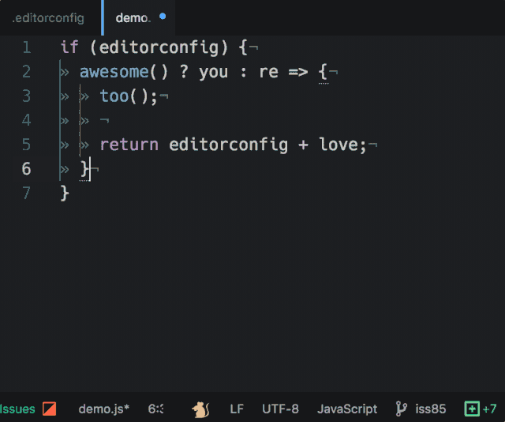

# EditorConfig

[![Build status: TravisCI][TravisCI-badge]][TravisCI-link]
[![Build status: AppVeyor][AppVeyor-badge]][AppVeyor-link]
[![Latest package version][APM-badge]][APM-link]

[EditorConfig](http://editorconfig.org) helps developers maintain consistent coding styles between different editors.

> "I will take a peanut butter sandwich on white bread" -- [Ralph S. Mouse](https://www.youtube.com/watch?v=3funeDWFr9g)




## Install

```console
$ apm install editorconfig
```

Or, Settings → Install → Search for `editorconfig`


## Getting started

See the EditorConfig [documentation](http://editorconfig.org) for a detailed description of the `.editorconfig` file format.

1.	Open a project containing an `.editorconfig` file.
2.	Whenever you open a file in the project (or change any `.editorconfig` file from within Atom),
	EditorConfig evaluates the EditorConfig settings for the current file.
3.	EditorConfig then applies these settings to your current editor pane.
	Any change you make **from now on** will follow the EditorConfig settings.
	EditorConfig does not automatically fix older files it considers as malformed.
4.	You can always check your EditorConfig settings against the current file using the `EditorConfig: Show State` command.
	You can try to fix malformed files using the command `EditorConfig: Fix File`.

> :bulb: If EditorConfig detects any issues which may prevent it from working properly a :mouse: will appear in the status bar; click on it to open the state notification.

> :warning: EditorConfig will not automatically fix malformed files (e.g. change all soft tabs to hard tabs) -- you need to use the `EditorConfig: Fix File` command on each malformed file. Keep in mind that malformed files (especially mixed tab characters) may lead to unexpected behaviour.


## Supported properties

-	[`root`](https://editorconfig.org/#supported-properties)
-	[`charset`](https://github.com/editorconfig/editorconfig/wiki/EditorConfig-Properties#charset)
-	[`end_of_line`](https://github.com/editorconfig/editorconfig/wiki/EditorConfig-Properties#end_of_line)
-	[`indent_style`](https://github.com/editorconfig/editorconfig/wiki/EditorConfig-Properties#indent_style)
-	[`indent_size`](https://github.com/editorconfig/editorconfig/wiki/EditorConfig-Properties#indent_size) /
	[`tab_width`](https://github.com/editorconfig/editorconfig/wiki/EditorConfig-Properties#tab_width) *(`indent_size` takes precedence over `tab_width`)*
-	[`insert_final_newline`](https://github.com/editorconfig/editorconfig/wiki/EditorConfig-Properties#insert_final_newline) *(setting this to `false` strips final newlines)*
-	[`max_line_length`](https://github.com/editorconfig/editorconfig/wiki/EditorConfig-Properties#max_line_length)
-	[`trim_trailing_whitespace`](https://github.com/editorconfig/editorconfig/wiki/EditorConfig-Properties#trim_trailing_whitespace)

> :bulb: Any malformed or missing property falls back to `unset` which leaves the control to Atom.

<a name="cr-caveat"></a>
> :warning: Atom does not support CR line-endings. When `end_of_line` is set to `cr`, EditorConfig will respect the setting when saving files, but their contents will appear to be squashed onto a single line.


## EditorConfig commands

- `EditorConfig: Fix File`: Fixes `indent_style` and `end_of_line` issues for the current editor.
- `EditorConfig: Fix File Quietly`: Same as `Fix File`, except no feedback is displayed after fixing.
- `EditorConfig: Show State`: Shows the current state of EditorConfig for your current editor.
- `EditorConfig: Generate Config`: Generates an initial `.editorconfig` for your project.


## Features

- Applies the settings from your `.editorconfig` file
- Ability to fix `indent_style` and `end_of_line` issues
- Syntax highlights `.editorconfig` files (now with specification-like case insensitivity)
- Ability to generate an `.editorconfig` file based on the current settings
- Displays a nifty :mouse: in the statusBar whose color shows you if EditorConfig faces any problems
- Clicking on the :mouse: invokes the `Show State` command for you
- Recognizes if you save any `.editorconfig` file and reapplies all settings to **all** opened editor-panes


## Example file

```editorconfig
root = true

[*]
indent_style = tab
indent_size = 3
end_of_line = lf
charset = utf-8
trim_trailing_whitespace = true
insert_final_newline = true

[*.{json,yml}]
indent_size = 2

[*.md]
trim_trailing_whitespace = false
```


## Changelog

See [`changelog.md`](./changelog.md).


## Troubleshooting

We're sorry to hear you're having trouble using `atom-editorconfig`!
Please bear some caveats in mind:

-	**Why isn't EditorConfig applying the indentation character to my files?**  
	EditorConfig is not intended to do so; it will apply the indentation char only to *new* indentations.
	You may try to fix indentation issues with the `EditorConfig: Fix File` command.
-	**Why is `indent_style` not working?**  
	You can set Atom's config setting "Tab Type" to either `soft` or `hard`, this prevents EditorConfig from influencing the indentation style.
	Set Atom's "Tab Type" to `auto` to allow EditorConfig taking control over the indentation characters.
-	**Why is _feature X_ not working?**  
	Some other packages (e.g. the [`whitespace`](https://atom.io/packages/whitespace) package) override the EditorConfig settings.
	In these cases, we try to alert you about confirmed interferences and suggest that you try disabling the other package.
	If you face any unreported issues, please [let us know][issues].

> :bulb: You can check how EditorConfig affects your current file by invoking the `EditorConfig: Show State` command. If EditorConfig detects any issues which may prevent it from working properly it displays a :mouse: in the status bar; clicking on it opens the state notification (like the `Show State` command).


## Help us get better

We would be happy to hear from you -- [please report any feedback, issues or ideas][issues].
Thank you! :gift_heart:

> :gift_heart: We thank our [contributors][] for their amazing work to make Atom support editorconfig!


## Maintainer
- [Alhadis](https://github.com/Alhadis)


## Alumni
- [Florian Breisch](https://github.com/florianb)


## License

MIT © [Sindre Sorhus](https://sindresorhus.com)


<!-- Referenced links -->
[issues]: https://github.com/sindresorhus/atom-editorconfig/issues/new
[contributors]: https://github.com/sindresorhus/atom-editorconfig/graphs/contributors

<!-- Badges -->
[TravisCI-badge]: https://travis-ci.org/sindresorhus/atom-editorconfig.svg?branch=master
[TravisCI-link]:  https://travis-ci.org/sindresorhus/atom-editorconfig
[AppVeyor-badge]: https://ci.appveyor.com/api/projects/status/h0bav8m09ld9vga2?svg=true
[AppVeyor-link]:  https://ci.appveyor.com/project/Alhadis/atom-editorconfig
[APM-badge]:      https://img.shields.io/apm/v/editorconfig.svg?colorB=brightgreen
[APM-link]:       https://atom.io/packages/editorconfig
